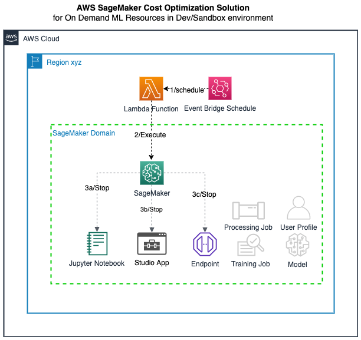

# aws-sagemaker-cost-optimization-app

## :brain: Amazon SageMaker Cost Optimization App Overview

This [SageMaker Cost Optimization Solution](aws-sagemaker-cost-optimization-app.py) solution streamlines the stopping of on-demand SageMaker resources such as Jupyter Notebooks, Studio apps (e.g. Data Wrangler Flows and Studio Notebooks), and Inference Model Endpoints and enforces best practices through automation.  The solution consists of a set of Python functions that can be run in CLI mode, referenced as part of a larger program or run as a standalone/scheduled Lambda function.  It is intended to be run in Development and Sandbox AWS environments where On-Demand resources should be stopped when they are not used.



### 1. Clone Git repo
git clone https://github.com/bishrtabbaa/aws-sagemaker-cost-optimization-app

### 2. Use Git repo locally
```
cd aws-sagemaker-cost-optimization-app

[uses default credentials and default region in ~/.aws/credentials]
python aws-sagemaker-cost-optimization-app.py 

bishrt@3c06302c8f5b aws-sagemaker-cost-optimization-app % python aws-sagemaker-cost-optimization-app.py                   
Checking for active SageMaker Resources in region: None
Found credentials in shared credentials file: ~/.aws/credentials
No active SageMaker Studio apps to stop
{'NotebookInstanceName': 'MySageMakerWorkshopNotebook', 'NotebookInstanceArn': 'arn:aws:sagemaker:us-east-2:645411899653:notebook-instance/MySageMakerWorkshopNotebook', 'NotebookInstanceStatus': 'InService', 'Url': 'mysagemakerworkshopnotebook.notebook.us-east-2.sagemaker.aws', 'InstanceType': 'ml.t3.medium', 'CreationTime': datetime.datetime(2024, 4, 28, 11, 8, 1, 401000, tzinfo=tzlocal()), 'LastModifiedTime': datetime.datetime(2024, 4, 28, 11, 11, 53, 787000, tzinfo=tzlocal())}
Stopping arn:aws:sagemaker:us-east-2:645411899653:notebook-instance/MySageMakerWorkshopNotebook
{'EndpointName': 'DEMO-endpoint-2024-04-28-16-48-56', 'EndpointArn': 'arn:aws:sagemaker:us-east-2:645411899653:endpoint/DEMO-endpoint-2024-04-28-16-48-56', 'CreationTime': datetime.datetime(2024, 4, 28, 11, 48, 57, 382000, tzinfo=tzlocal()), 'LastModifiedTime': datetime.datetime(2024, 4, 28, 11, 52, 3, 387000, tzinfo=tzlocal()), 'EndpointStatus': 'InService'}
Stopping SageMaker Model Endpoints
Deleting SageMaker Model Endpoint: arn:aws:sagemaker:us-east-2:645411899653:endpoint/DEMO-endpoint-2024-04-28-16-48-56
Stopped SageMaker Resources: 2

[uses default credentials in ~/.aws/credentials and user-defined region parameter]
bishrt@3c06302c8f5b aws-sagemaker-cost-optimization-app % python aws-sagemaker-cost-optimization-app.py --region us-west-2
Checking for active SageMaker Resources in region: us-west-2
Found credentials in shared credentials file: ~/.aws/credentials
No active SageMaker Studio apps to stop
No active SageMaker Notebook instances to stop
No active SageMaker Model Endpoints to stop
No active SageMaker MLflow Servers to stop
Stopped SageMaker Resources: 0
```

### 3. Deploy Serverless app to AWS as SAM CloudFormation stack

#### 3.1 Build and Package Lambda Layer with latest boto3

```
mkdir python
cd python
pip3 install boto3 -t .
cd ..
zip -r my-aws-lambda-python-boto3-layer.zip python
aws lambda publish-layer-version --region us-east-1 --layer-name my-aws-lambda-python-boto3-layer --zip-file fileb://my-aws-lambda-python-boto3-layer.zip
aws lambda list-layers
```

#### 3.2 Build and Package Lambda Function

The default parameter values of the CloudFormation stack will result in stopping SageMaker Apps, Notebooks, MLflow Servers, and Endpoints on a weekly basis which is the common case to prevent cost overruns.  You can change the Lambda function configuration at deployment time and also once the stack has been deployed.

```
aws cloudformation deploy --template-file aws-sagemaker-cost-optimization-app.yaml --stack-name AwsSageMakerCostOptimizationAppStack --capabilities CAPABILITY_NAMED_IAM --region us-east-1
```